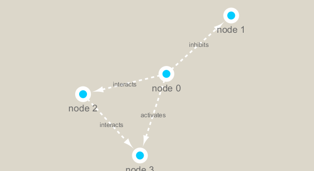

```{r setup, include=FALSE}
knitr::opts_chunk$set(echo = TRUE)
```

# Introduction and loading data

  Cytoscape is a visualization tool that allows analyzation of data with a network-like map.

  For this assignment, the file "galFiltered.sif" was imported and loaded to Cytoscape.

```{r}
gal.data <- read.csv("galExpData.csv")
head(gal.data)
```

By loading our data, we can see that the columns tell us different data points corresponding to each gene.

We can use this to better organize our data.


# Setting up Cytoscape and R

  At this point, I've already completed the graphic manipulation portion of Cytoscape. Refer to class handout page for more details.
  
  Now it remains to setup R so that it can read .cys (Cytoscape) files.
  
  *(Installation of RCy3 package should proceed through BiocManager::install. Search "Bioconductor", or type **install.packages("BiocManager")** for more details.)*
```{r results = 'hide', message = FALSE}
library(RCy3)
library(igraph)
library(RColorBrewer)

cytoscapePing() #Check to see if Cytoscape is online
cytoscapeVersionInfo() #Check Cytoscape version
```
  

# Testing different capabilities of our loaded R packages.

*Creating a simple Cytoscape graph*

```{r message = FALSE, results = 'hide', message = FALSE}
s <- makeSimpleGraph()
createNetworkFromGraph(s, "myGraph")
```

```{r message = FALSE, echo = FALSE}
fig <- exportImage(filename = "demo", type = 'png', height = 350)
knitr::include_graphics("./demo.png")
```


*Switching Styles*


```{r message = FALSE, echo = FALSE}
setVisualStyle("Marquee")
fig <- exportImage(filename = "demo_mq", type = "png", height = 350)

```


# Reading our metagenomics data

```{r}
prok.cor.vir <- read.delim("virus_prok_cor_abundant.tsv", stringsAsFactors = F)
head(prok.cor.vir)

```

*Strings As Factors False?*
*This means that the subsequent character data (like name, type, etc.) are treated as character values, and not as a qualitative data.*

```{r message = FALSE}
g <- graph.data.frame(prok.cor.vir, directed = F)
class(g)
plot (g)
```

Cleaning up the messy graph. To do this, we will use the parameters **vertex.label = NA** and **vertex.size = n**. The first parameter removes the variable labels, while the second one manipulates the sizes of the nodes.
```{r}
plot(g, vertex.size = 3, vertex.label = NA)
```


# ggplot usage

One of R's strongest packages is ggPlot. Therefore, doing work with other packages may feel a little lackluster. We will use ggPlot to represent our metagenomics data.

```{r message = FALSE}
library(ggraph)

ggraph(g, layout = 'auto') +
  geom_node_point(color = 'steelblue') +
  geom_edge_link(alpha = 0.25) +
  theme_graph()

```

*Loading our data to Cytoscape & looking at attributes*

```{r message = FALSE}
createNetworkFromIgraph(g, "myIgraph")
V(g)
E(g)
```

# Network community detection

Using *cluster_edge_betweeness* function will allow us to look at the different subgraphs that exist between clusters of nodes. We will then plot the result to graphically represent our data.
```{r message = FALSE}
cb <- cluster_edge_betweenness(g)

cb

plot(cb, y = g, vertex.label = NA, vertex.size = 3)
```

# Centrality analysis

Centrality gives an estimation of how important a node is for the connectivity of a network. Installed the package called "BBmisc" to visualize this part.

```{r result = 'hide', message = FALSE}
pr <- page_rank(g)
head(pr$vector)
```

*Centrality visualization*

```{r}
v.size <- BBmisc::normalize(pr$vector, range = c(2,20), method = 'range')
plot(g, vertex.size = v.size, vertex.label = NA)
```

# Betweenness analysis

Betweenness centrality is based on shortest paths.

```{r}
b <- betweenness(g)
v.size <- BBmisc::normalize(b, range = c(2,20), method = 'range')

plot(g, vertex.size = v.size, vertex.label = NA)

```


# Taxonomic classification for network annotation

Now we will start to classify our data points. Loading up and taking a look at our data yields:

```{r message = FALSE, echo = FALSE}
phage.id <- read.delim("phage_ids_with_affiliation.tsv")

head(phage.id)

bac.id <- read.delim("prok_tax_from_silva.tsv", stringsAsFactors = F)
head(bac.id)

```


Loading up genomic ID.

```{r}
gene.nodes <- as.data.frame(vertex.attributes(g), stringsAsFactors = FALSE)
head(gene.nodes)
```

Merge and polishing data

```{r message = FALSE, result = 'hide'}
z <- bac.id[,c("Accession_ID", "Kingdom", "Phylum", "Class")]
n <- merge(gene.nodes, z, by.x = 'name', by.y = "Accession_ID", all.x = T)
head(n)
colnames(n)

colnames(phage.id)


y <- phage.id[, c("first_sheet.Phage_id_network", "phage_affiliation", "Tax_order", "Tax_subfamily")]

x <- merge(x = n, y = y, by.x = "name", by.y = "first_sheet.Phage_id_network", all.x = T)

x <- x[!duplicated((x$name)),]
head(x)

gene.nodes <- x
```

The addition of Kingdom, Phyla, and Class to our data point allows us to have a better organized data table. It looks pretty, and we should like pretty data tables!


# Sending our network out to Cytoscape

Clearing our Cytoscape program and prepping data

```{r message = FALSE, result = 'hide'}
deleteAllNetworks()

gene.edges <- data.frame(igraph::as_edgelist(g))

colnames(gene.nodes)[1] <- "id"

colnames(gene.edges) <- c("source", "target")
gene.edges$weight <- igraph::edge.attributes(g)$weight

createNetworkFromDataFrames(gene.nodes, gene.edges, title = "Tara_Oceans")
```


# Final result visualization with ggplot

```{r message = FALSE, edge = FALSE}
ig <- createIgraphFromNetwork("Tara_Oceans")

ggraph(ig, layout = 'auto')+
  geom_node_point(color = 'steelblue')+
  geom_edge_link(alpha = 0.25)+
  theme_graph()
```

*Import final result image from Cytoscape for comparison*
```{r}

```

